# SteamCompare

[Info](#info)

[Getting a Steam API Key](#getting-a-steam-api-key)

[Installing the Program](#installing-the-program)

[Using the Program](#using-the-program)

[To-Do](#to-do)

[Pull Requests and Issues](#pull-requests-and-issues)

[Credits](#credits)

---

## Info
So this is a little project of mine that uses the brand new .NET MAUI. The application asks for a Steam API key as well as two Steam usernames. This is my first ever actual C# program, so code may be pretty messy. If you think you can simplify the code, or clean it up, please feel free to [make a pull request.](#pull-requests-and-issues)

At this time, MAUI is still very buggy. A big example of that is the fact I can't provide a binary because it won't work, since WinUI3 doesn't support self-contained apps yet. For more information, as well as a possible timeframe of a binary, please refer to the following issues:

[MAUI Issue](https://github.com/dotnet/maui/issues/3166)

[WinUI3 Issue](https://github.com/microsoft/WindowsAppSDK/issues/2684)

Known issues I can't fix (these are issues based around MAUI or another Microsoft owned repo):

[Icon Blue Border Issue](https://github.com/dotnet/maui/issues/5162)

[Navigation buttons appear to be disabled, but they aren't](https://github.com/dotnet/maui/issues/8309)
 
---

## Getting a Steam API Key

NOTE: Keep your Steam API key a **SECRET**! Do not give it to anyone, as it allows you to do just about anything regarding Steam, which includes making trades.

Step 1. Go to the [Steam API Key site](https://steamcommunity.com/dev/apikey)

Step 2. In the field labeled Domain Name, type in "127.0.0.1". This stands for localhost (since the application will be running on your computer). Ensure the checkbox is checked and click Register.

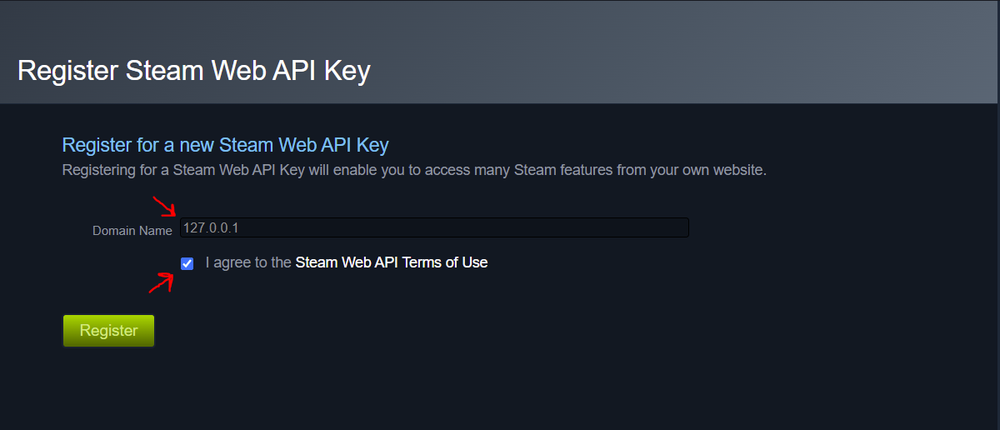

Step 3. Copy the "Key" field and paste this into the application in the API key field.

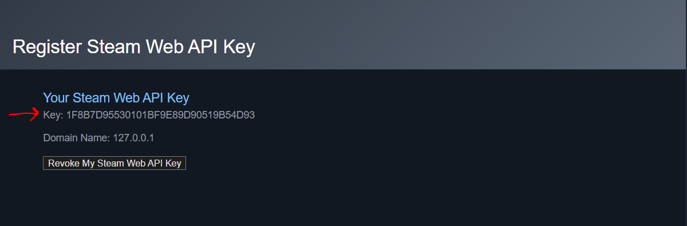

---

## Installing the Program

Unfortunately, since there is no binary (an exe), the process of installing is rather long. Currently there is no timeline for a binary, since it's completely dependant on Microsoft.

Step 1. Right click on the MSIX package, and click "Properties"

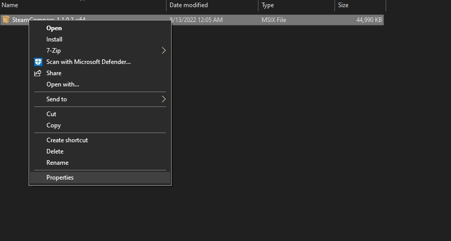

Step 2. Go to the "Digital Signatures" tab on the Properties page. Click the certificate and click "Details"

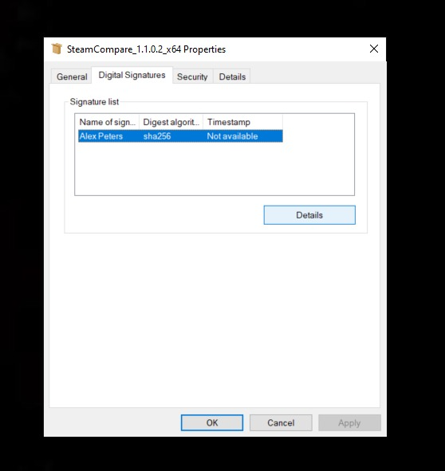

Step 3. Click "View Certificate"

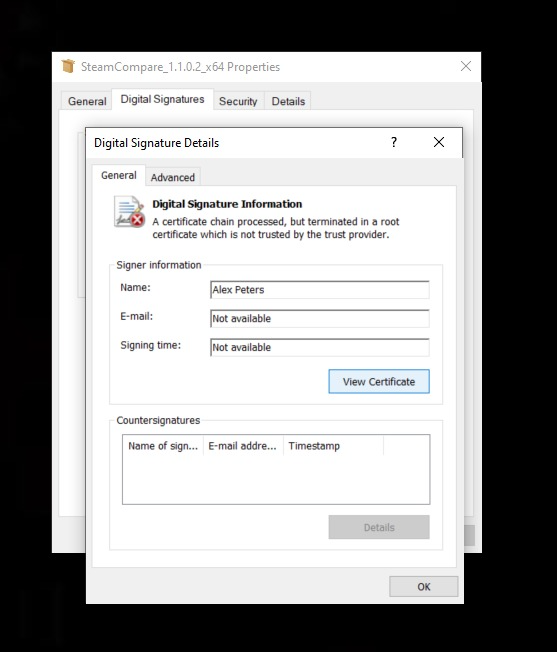

Step 4. Click "Install Certificate"

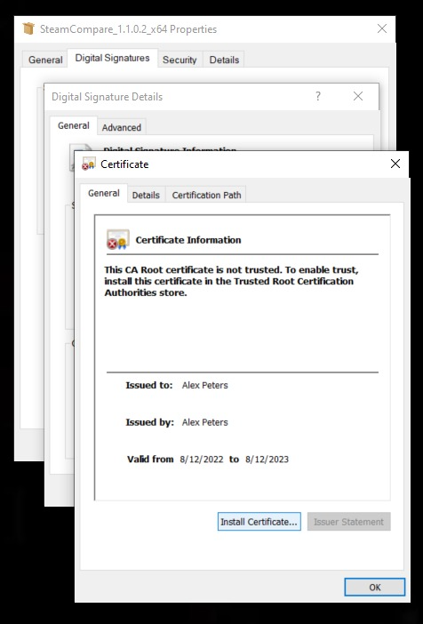

Step 5. Click "Local Machine" and click Next

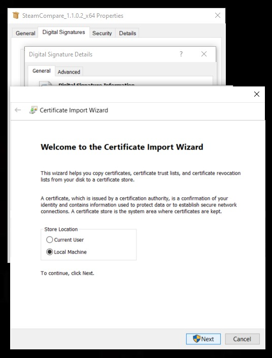

Step 6. Click "Place all certificates in the following store" and click "Browse". Select "Trusted People"

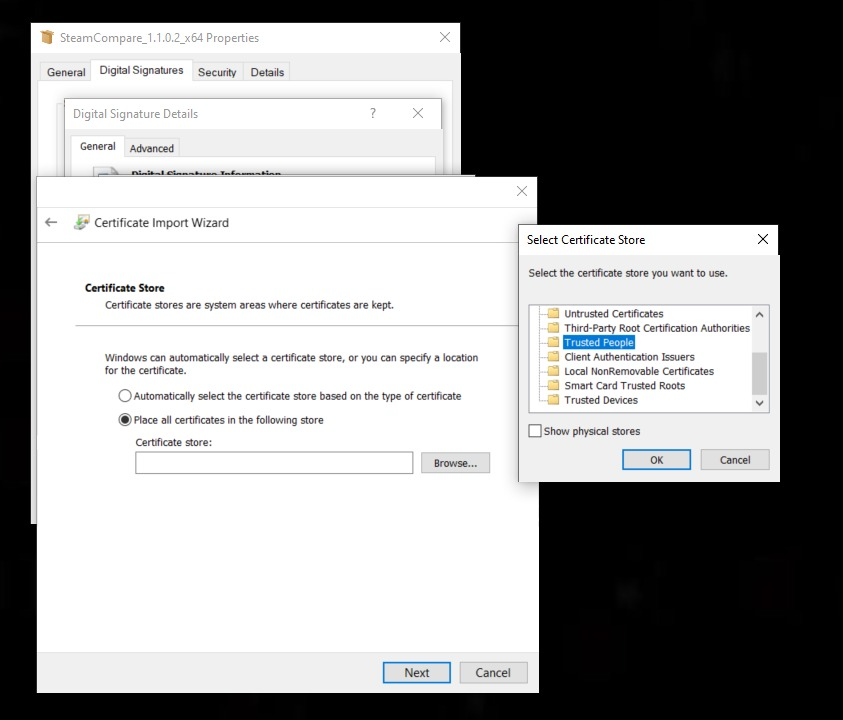

Step 7. Click Ok, then Next

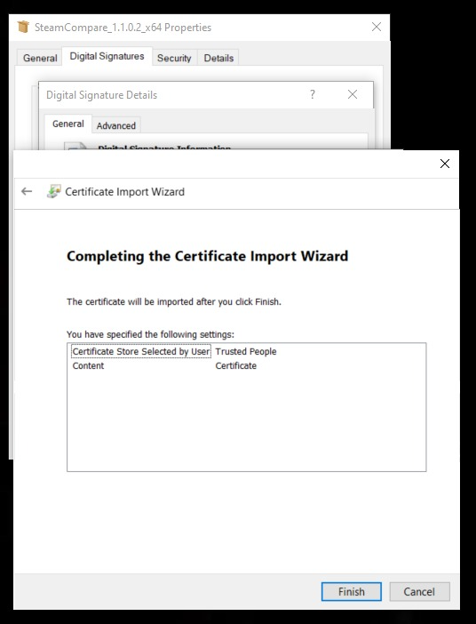

Step 8. Click Finish. The import successful message should appear. Click Ok until all the additional windows are closed.

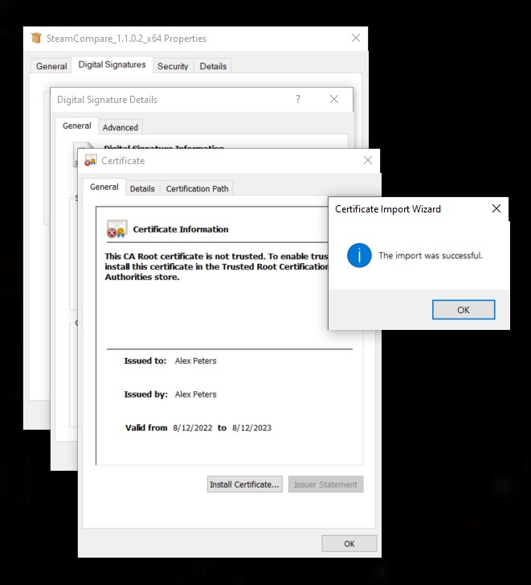

Step 9. Double click the MSIX package and then click Install. This might take a little bit depending on your computer screen.

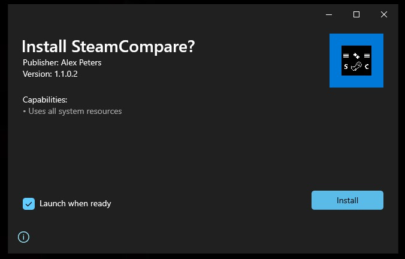

---

## Using the Program

### Start Screen

When the program first starts up, you'll be greeted with a welcome screen. Click the Start button to continue.

### API Key Screen

Next you'll see the API Key screen. This is where you'll paste the key from the Steam website (See [here](#getting-a-steam-api-key))

### Comparison Screen

You'll see the comparison screen next. This is where you'll be typing the information of the users you want to compare games with. Type either the numerical SteamID64 number, or their steam username. ⚠️ NOTE: The Steam username is *NOT* the same thing as a display name.

### Results Screen

Once you hit this screen, click the Get Results button to start the process of checking inputs and generating results. If you want to refresh, just hit the button again. ⚠️ NOTE: The amount of time this takes varies based on internet connection and computer speed.

---

## To-Do

I intend to do everything in this list, however, depending on my schedule, I may or may not implement them.

✅ = Finished

🟨 = In progress

⚠️ = Halted due to API issues (these may take a while to fix, if at all, since it's not up to me)

❌ = Not started

- ✅ Make an MSIX package while we wait for .NET MAUI to support simple .exe files
- ❌ Make a Details screen when clicking a game on the results list. The details screen will show additional information about the game, as well as launch the game if requested.
- ⚠️ Ensure the entire program works on a Mac | [Issue here](https://github.com/babelshift/SteamWebAPI2/issues/130)
- ❌ Make Android version (Possibly in Google Play store?)
- ❌ Make iOS versions of the program (won't be in app store, will have to be sideloaded)
- ❌ Ensure ARM compatibility
- 🟨 Rewrite code to save data in classes (Expected in v1.2)
- 🟨 Make a settings page; this will allow notifications, color changing, anything else I can think of (expected in v1.2)
- ❌ Make info page, which shows debug information, and other info regarding the application
- ❌ Create progress bar when getting results, which will help users understand the progress on slower computers and internet (expected in v1.2)
- ❌ Ensure window titles are correct on both Windows and macOS
- ❌ Add the ability to check for updates to the application
- ❌ Save settings to a file if requested
- ❌ Create splashscreen with instructions on first launch

---

## Pull Requests and Issues

If you believe you can help to improve the code, while retaining the same (or better) functionality, I welcome you to make a pull request. Anyone is welcome to do this, even newcomers, as I am new to C# as well. When creating a pull request, ensure there are no merge conflicts if possible, and that you detail the changes you made and why you made them. In addition, if the program won't compile as a result of your changes, they will be reverted or declined. Thank you for your help!

If you believe you've come across an issue, feel free to create an issue in the Issues tab. I will try my best to solve it.

---

## Credits

- Microsoft for making [.NET MAUI](https://github.com/dotnet/maui)
- babelshift for translating the [SteamWebAPI to C#](https://github.com/babelshift/SteamWebAPI2)
